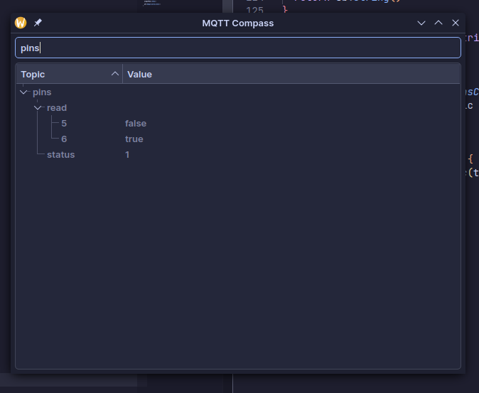

# MQTT Compass

A Simple MQTT Browser (Golang + QT6). It's inspired by MQTT Explorer.



## Features

 - It works (mostly)
 - Has search functionality (questionable)
 - Has context menu for topics (full topic has panic attack)

## Build

### Linux

Requires `qt6-qtbase-devel` package.

```bash
# Enable clang for marginal performance improvement
go env -w "CC=clang"
go env -w "CXX=clang++"
# Build
go build
```

For more detailed information about use of QT read [this](https://github.com/mappu/miqt?tab=readme-ov-file#linux-native).

### Windows

No idea, more info [here](https://github.com/mappu/miqt?tab=readme-ov-file#windows-native).

### MacOS

Also no clue, read [more](https://github.com/mappu/miqt?tab=readme-ov-file#macos-homebrew).